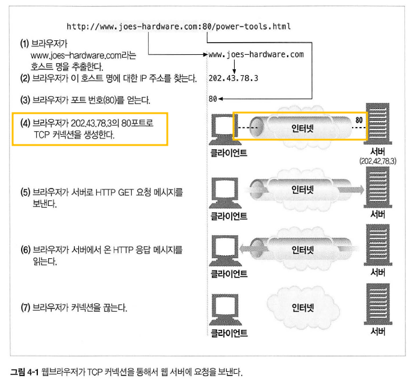
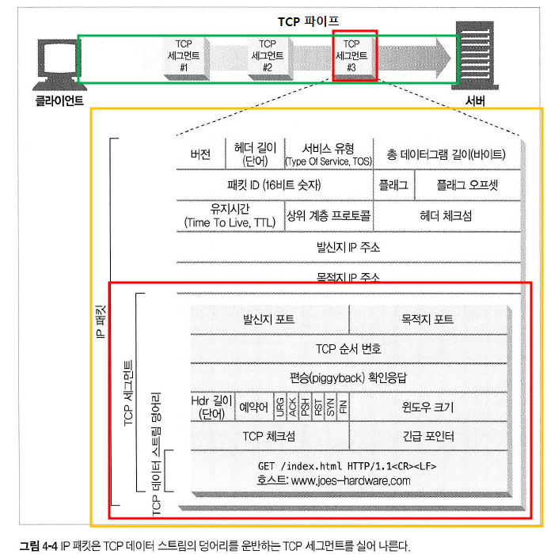
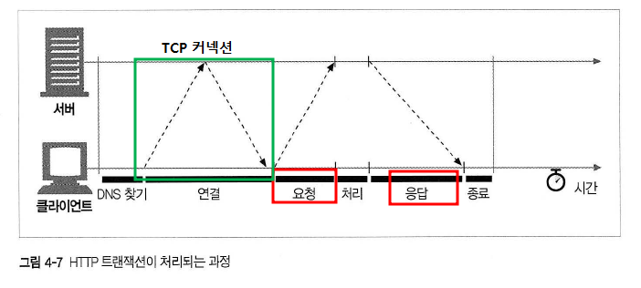
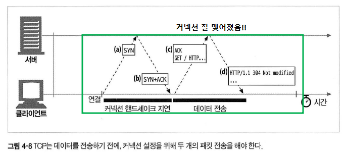
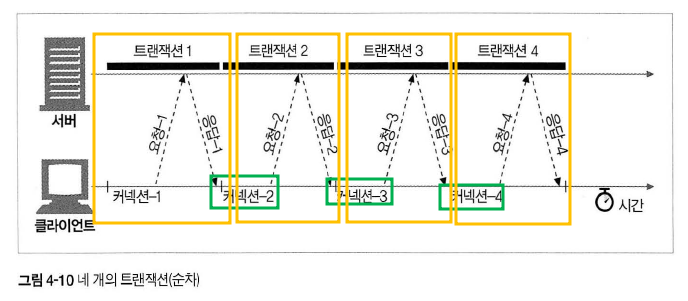

# 4장 커넥션 관리

### 4.1 TCP 커넥션

- HTTP 통신

  - 패킷 교환 네트워크 프로토콜들의 계층화된 집합인 `TCP/IP` 를 통해 이루어짐
  - 응답 요청을 받는 그 과정을 말함

- TCP 커넥션
  

  - 손실 혹은 손상되거나 순서가 바뀌지 않고 안전하게 전달
  - ip주소를 찾고 포트번호를 얻은 후에 클라이언트와 서버를 연결

- TCP
  

  - 신뢰할 수 있는 데이터 통신 방식을 제공 (프로토콜 이므로)
  - HTTP가 보내온 메세지를 TCP 커넥션을 통해서 메세지 데이터 내용을 순서대로 보냄
  - 세그먼트 라는 단위로 데이터(스트림)을 잘게 나누고, ip 패킷에 담아 보냄

- TCP 커넥션 유지
  - [발신자 IP, 발신자 포트, 수신자 IP, 수신자 포트] ⇒ 유일한 커넥션 생성
  - IP 주소 : 해당 컴퓨터에 연결
  - 포트 : 해당 어플리케이션으로 연결 (회사 직원의 내선전화번호)

### 4.2 TCP의 성능에 대한 고려

- HTTP 트랜잭션
  

  - 요청과 응답에 이르는 작업의 한 단위
  - 커넥션이 맺어지면 TCP 파이프라인을 통해 데이터를 전송함
  - HTTP 지연은 TCP 네트워크 지연때문에 발생 (그림에 보면 처리하는 과정은 상당히 짧음)

- TCP 커넥션 핸드셰이크 지연  
  
  - TCP 커넥션을 `열 때` TCP 소프트웨어는 커넥션을 맺기 위한 조건을 맞추기 위해 연속적으로 IP 패킷을 교환하는 과정
  - TCP 는 클라이언트가 확인 응답 패킷과 함께 `데이터` 도 함께 보낼 수 있음
  - SYN/SYN+ACK 헨드세이크가 HTTP 트랜잭션의 지연을 (대부분) 발생시킴 (HTTP 트랜잭션의 50%이상의 시간을 TCP 구성하는데 쓴다고 함)
  - 포트 고갈 문제 : 커넥션은 재사용될 수 없고, 발신지 포트의 수는 제한되어 있어서 장비 더 많이 사용하거나 가상 IP 주소를 쓰는 방식으로 해결함

### 4.3 HTTP 커넥션 관리

` HTTP 커넥션은 몇몇 사용 규칙을 제외하고는 TCP 커넥션에 불과하다.`

- 중개서버

  - HTTP는 클라이언트 --- 서버1 ---- 서버2---- 메인서버 와 같이 중개 서버가 놓이는 것을 허락함
  - Connection header : 현재 맺고 있는 커넥션에 적용될 옵션을 지정할 수 있음

- 순차적인 트랜잭션 처리 지연
  
  - 처리하고 그 다음 커넥션을 받기 까지 지연현상

### 4.4 병렬 커넥션

### 4.5 지속 커넥션

### 4.6 파이프라인 커넥션

### 4.7 커넥션 끊기에 대한 미스터리

### 4.8 추가 정보
